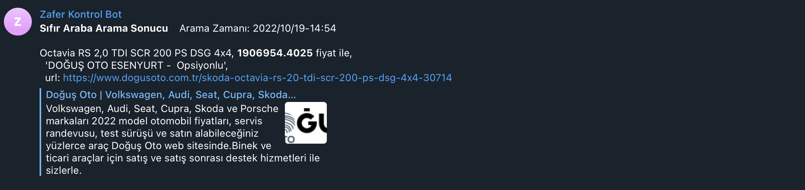

# Doğus Araç Arama Telegram Botu
Bu Doğuş Oto'daki 0 araçların mevcut durumunu kontrol etmek amacıyla telegrama bildirim gönderen bir proje yapılmıştır.

##  Kurulum

```
git clone https://github.com/zaferdurkut/gtuseg.git
cp temp_config.py config.py
```


Aşağıdaki parametreler telegram için doldurulmalı 
```
CAR_CONTROL_TOKEN = ""
CAR_CONTROL_CHAT_ID = ""
```

Aşağıdaki parametreler aradığınız aracın url üzerindeki key'idir. ve istediğiniz araç için key oluşturup main.py içindeki fonksiyona verilebilir.
```
DOGUS_OTO_GOLF_KEY = ""
DOGUS_OTO_OCTAVIA_KEY= ""
```

Çalıştırma
```
python main.py
```

### Örnek Bildirim


